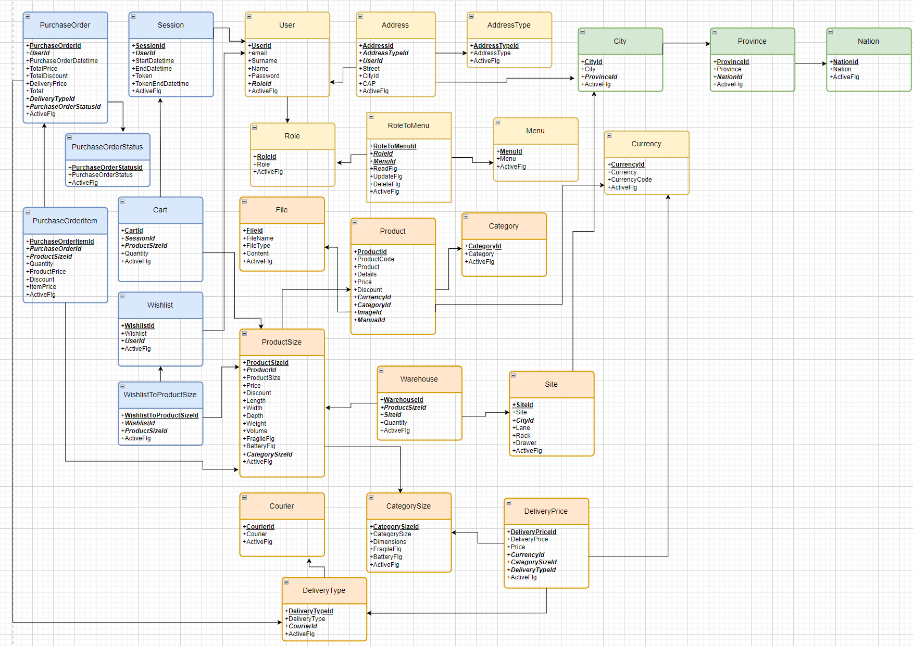

<p align="center">
 
</p>
<h1 align="center">Tiger-Games.com</h1>

<p align="center">
 <a href="#contributors"></a>
</p>

> A gaming e-commerce site built with TypeScript 


## About 

Tiger-games is the application that we build in [DeveloperWay](https://www.developerway.it/). 

## Running the project

1. Install [Node](https://nodejs.org/en) and [Yarn](https://classic.yarnpkg.com/lang/en/docs/install/) if you haven't already.
2. Copy the `.env` template file and set the enviroment variables both for server and client.

```bash
cp .env.template .env
```

```bash
cd client && cp .env.template .env
```

4. Install all the dependencies:

```bash
yarn && cd client && yarn
```

<!-- You can visit the app by going to `http://localhost:3000`. -->

### Demo 

[You can visit the site here](https://github.com/DeveloperWayIT/group-2).

> `Note`: It's currently deployed on free tier Heroku, which has some undesirable side-effects like shutting off the server during periods of inactivity. So if it's down for you, refresh a couple of times. Thinking about migrating this to a serverless architecture later on.

### Built with

#### Frontend

- [React.js](https://reactjs.org/)
- [Redux](https://redux.js.org/)
- [Styled-components](https://styled-components.com/)

<!-- ## Project visualization -->
<!-- Here's a large-scale visualization of the repo. As I put more time into the front-end, it may change a little bit. -->
#### Backend

- [Prisma](https://www.prisma.io/) - Next-generation Node.js and TypeScript ORM
- [Express.js](https://expressjs.com/) - Lightweight webserver
- [PostgreSQL](https://www.postgresql.org/) - The World's Most Advanced Open Source Relational Database

#### Data Model
- Designed to be adaptable and scalable to any e-commerce website
<p align="center">
 
</p>

## Contributing


Dive into the dynamic realm of Tiger-games, a thrilling open-source project where every contribution is a celebration of creativity! Uncover the magic by delving into our curated collection of open issues, bugs, and enhancements neatly organized on the issues tab, each waiting to be transformed into a masterpiece. Your voice matters—take charge by opening bug tickets and proposing exciting new features that spark innovation.

Discover a gateway to our world through easy bugs and features, adorned with the "good first issue" label, ensuring a welcoming and rewarding experience for newcomers. Join the Tiger-games community, where passion meets play, and let's craft a gaming legacy together!

## Contributors 👨‍💻👨‍💻

Thanks goes to these wonderful people

<!-- ALL-CONTRIBUTORS-LIST:START - Do not remove or modify this section -->
<!-- prettier-ignore-start -->
<!-- markdownlint-disable -->
<table>
  <tr>
    <td align="center"><a href="https://www.linkedin.com/in/manueldesole/"><br /><sub><b>Manuel Desole</b></sub></a><br />
    <td align="center"><a href="https://www.linkedin.com/in/domenico-sarsano/"><br /><sub><b>Domenico Sarsano</b></sub></a><br />
  </tr>
</table>

<!-- markdownlint-enable -->
<!-- prettier-ignore-end -->
<!-- ALL-CONTRIBUTORS-LIST:END -->

<!-- This project follows the [all-contributors](https://github.com/all-contributors/all-contributors) specification. Contributions of any kind welcome! -->

## License

This project is licensed under the ISC License - see the [LICENSE.md](https://github.com/stemmlerjs/ddd-forum/blob/master/LICENCE.md) file for details

